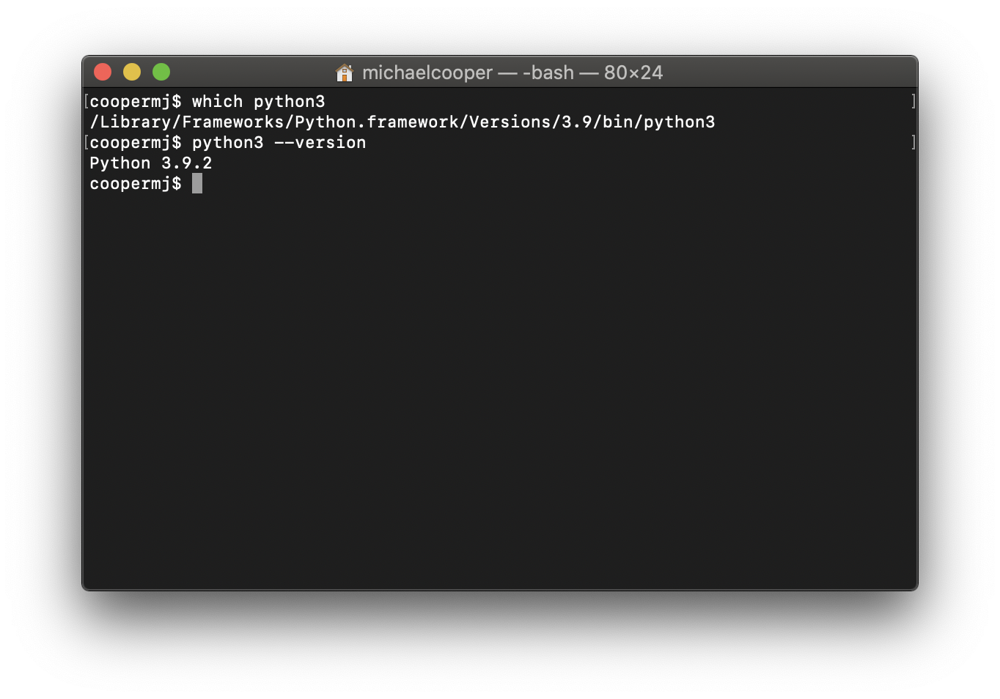

# Installing Python on macOS

Hello!

This document provides a walkthrough to set up a Python development environment for [CS41](https://stanfordpython.com) on macOS. Alternate versions of this guide exist for [Linux](https://github.com/stanfordpython/python-handouts/blob/master/installing-python-linux.md) and [Windows](https://github.com/stanfordpython/python-handouts/blob/master/installing-python-windows.md) development.

## Overview

In this course, you'll be writing lots of Python code, so it's important to get your development environment set up and ready-to-go. Moreover, we will sometimes need to install dependencies and packages, so we want to make sure that everything gets installed to the right place as well. The tools we learn about in this document will also be useful for any external development you might pursue in Python.

Throughout this document, we will:

1. Install Python 3.8.0
2. Create a virtual environment using this version of Python.
3. Inside this environment, install useful packages.
4. (Optional) Modify the shell startup script to always activate our environment.

Let's get started!

## Install Python 3.8.0

*Note: If you use `brew` or another package manager for Python installations, see the note at the bottom of this section instead.*

Navigate to the [Python 3.8.0 download page](https://www.python.org/downloads/release/python-380/) in a web browser.

Scroll to the bottom of the page to the section labelled "Files."

Install the Python distribution that corresponds to your version of macOS. If you are running OS X 10.9 (Mavericks) or later, download the ["macOS 64-bit installer."](https://www.python.org/ftp/python/3.8.0/python-3.8.0-macosx10.9.pkg). If you are running OS X 10.6 (Snow Leopard), OS X 10.7 (Lion), or OS X 10.8 (Mountain Lion), you will need to download an older version of Python; Python 3.7.6 can be downloaded at [this link](https://www.python.org/downloads/release/python-376/) by clicking on the ["macOS 64-bit/32-bit installer"](https://www.python.org/ftp/python/3.7.6/python-3.7.6-macosx10.6.pkg). If you need, you can determine which macOS your computer is running with [these instructions from Apple](https://support.apple.com/en-us/HT201260).

After downloading, double-click the downloaded file, and follow the on-screen instructions.

Let's double check that Python 3.8.0 was installed correctly.

For the remainder of this setup document, we assume that you have a basic familiarity with the command line. We understand that not everyone will feel comfortable with the command line, because it is usually covered starting in CS107. However, I highly recommend using Nick Troccoli's amazing [CS107 resources](https://web.stanford.edu/class/archive/cs/cs107/cs107.1194/resources/) for this quarter if you feel less experienced, particular the section titled "Common Unix Commands."

The main takeaway is the following: If you something of the following form in this guide (you'll see this quite a few times!):

```
psarin$ command
```

Then copy and paste the command into your command line prompt. 

Two quick notes:

1. The text before the `$` can vary dramatically. It is not necessarily your username. In this case, we are assuming that the username is `psarin` and that is the text which is shown before the `$` at your command prompt. (The below image illustrates a terminal in which the username does not appear directly before the `$`).
2. Below is a quick example of how you may go about running the commands immediately following this list. This is designed to clear up any ambiguity related to running commands at the command line. 



Open up a command line prompt (likely using Terminal.app or iTerm.app), and run the following commands:

```
psarin$ which python3
/Library/Frameworks/Python.framework/Versions/3.8/bin/python3
psarin$ python3 --version
Python 3.8.0
```

If you see the output shown above, then Python 3.8.0 was installed correctly on your machine!

Let's celebrate by writing some code! Run the following from a command prompt. You should see the following output, which leaves you at an interactive prompt, at which you can write Python code.

```
psarin$ python3
Python 3.8.0 (v3.8.0:fa919fdf25, Oct 14 2019, 10:23:27)
[Clang 6.0 (clang-600.0.57)] on darwin
Type "help", "copyright", "credits" or "license" for more information.
>>> print("Hello world!")
Hello world!
>>> quit()
psarin$ 
```

Try writing some Python (perhaps `print("Hello world!")`) in the interactive interpreter! When you're done, you can exit the interactive interpreter by entering `quit()` at the Python command prompt or by pressing CTRL+D.

#### Other package managers: `brew`

[Homebrew](https://brew.sh/) is "the missing package manager for macOS." It's a great way to install, upgrade, and manage many different types of packages on macOS, including Python. If you are not using `brew`, there is no requirement that you start for CS41. However, if you are already using `brew`, you might as well install Python through brew.

Run `brew install python3`. This will fetch the latest version of Python (which might not be Python 3.8.0, but that's all we can do).

Then, continue the process above, after the installation of Python 3.8.0.

### Troubleshooting

#### `which python3` shows no output
The `which` command searches your computer for a program matching a name. If `which python3` shows no output, it means that your computer can't find any appropriate `python3`. Pause and flag down a member of the course staff to help debug, or ask on Piazza. Include as much detail as you can about the problem.

#### `python3 --version` does not show `Python 3.8.0`
In this case, the version of Python 3 your computer wants to run is not the Python 3.8.0 that we just downloaded. Pause and flag down a member of the course staff to help debug, or ask on Piazza. Include as much detail as you can about the problem.

## Create a virtual environment

We've correctly installed Python, so next we will create a virtual environment. You can learn more about virtual environments [here](https://github.com/stanfordpython/python-handouts/blob/master/virtual-environments.md) or at the end of our [lecture slides](https://stanfordpython.com/#lectures) on Python fundamentals, but for now it is sufficient to think of a virtual environment as an isolated sandbox for Python packages and dependencies.

Specifically, we will create a folder named `cs41-env` in your computer's home folder. The configuration of our virtual environment will live entirely inside of this folder.

```
psarin$ python3 --version
Python 3.8.0
psarin$ python3 -m venv ~/cs41-env
```

If these two lines execute without error, you have successfully created a virtual environment named `cs41-env`.

*Note: If you move the `cs41-env` folder, some of the internal structure of the virtual environment can break in unpredictable ways. This is one of the drawbacks of standard virtual environments that motivate our more advanced usage of `virtualenvwrapper` later in this document.*

### Activating a virtual environment

For a given terminal session, a virtual environment is either active or inactive at any moment in time. To activate our virtual environment, you will need to run

```
psarin$ source ~/cs41-env/bin/activate
(cs41-env) psarin$
```

*Note: If your shell is `tcsh` or `csh`, you will have to run `source ~/cs41-env/bin/activate.csh` instead. If your shell is `fish`, you will have to run `. ~/cs41-env/bin/activate.fish` instead.*

Observe that our command prompt, which previously was `psarin$`, now is `(cs41-env) psarin$`. This is one method by which you can see whether a virtual environment is activated.

### Deactivating a virtual environment

Deactivating a virtual environment is easy. From an activated environment, simply run

```
(cs41-env) psarin$ deactivate
psarin$
```

Don't worry if you deactivate from an inactive environment. Nothing bad will happen, although you might see a `-bash: deactivate: command not found` error message, which you can safely ignore.

### Using an activated virtual environment.

Let's reactivate our virtual environment to see what's different when a virtual environment is active.

```
psarin$ source ~/cs41-env/bin/activate
(cs41-env) psarin$ which python3
/Users/psarin/cs41-env/bin/python3
(cs41-env) psarin$ which python
/Users/psarin/cs41-env/bin/python
(cs41-env) psarin$ which pip3
/Users/psarin/cs41-env/bin/pip3
(cs41-env) psarin$ which pip
/Users/psarin/cs41-env/bin/pip
```

It looks like all of our python-related commands are now located inside of the virtual environment. That's a good thing! You can confirm this by seeing that `/Users/psarin/cs41-env/bin:` is the first entry of the string printed by running `echo $PATH`.

Moreover, observe that:

```
(cs41-env) psarin$ python3 --version
Python 3.8.0
(cs41-env) psarin$ python --version
Python 3.8.0
(cs41-env) psarin$ pip3 --version
pip 19.3.1 from /Users/psarin/cs41-env/lib/python3.8/site-packages/pip (python 3.8)
(cs41-env) psarin$ pip --version
pip 19.3.1 from /Users/psarin/cs41-env/lib/python3.8/site-packages/pip (python 3.8)
```

The big takeaway is that, inside our active virtual environment, the commands `python` and `pip` now refer to Python 3.8.0 and it's associated package manager.

For example, when the virtual environment is active, we can enter an interactive Python 3 prompt simply by running:

```
psarin$ python
Python 3.8.0 (v3.8.0:fa919fdf25, Oct 14 2019, 10:23:27)
[Clang 6.0 (clang-600.0.57)] on darwin
Type "help", "copyright", "credits" or "license" for more information.
>>>
```

*As a reminder, you can quit the interactive Python prompt with `quit()` or CTRL+D.*

## Use `pip` to Install Useful Packages

Next, we'll install useful Python packages that will serve us over the duration of this course. Let's first make sure that we're have activated the virtual environment.

```
psarin$ source ~/cs41-env/bin/activate
```

Now, we'll update `pip`, Python's builtin package manager, just to make sure it's on the latest version (it should be).

```
(cs41-env) psarin$ pip install --upgrade pip
Requirement already up-to-date: pip in ./cs41-env/lib/python3.8/site-packages (19.3.1)
```

After, we'll install the suite of Jupyter tools and some additional useful packages

```
# Really, really make sure that you have activated `cs41-env` before running this line!
(cs41-env) psarin$ pip install "prompt-toolkit==2.0.10" "ipython[all]" jupyter jupyterlab numpy scipy matplotlib nltk scikit-learn requests flask pycodestyle autopep8 Pillow
```

This will produce a huge amount of output, as Python is downloading these third-party libraries and tools from the internet and storing them inside our virtual environment. These packages will be available when our virtual environment is activated, but will not necessarily be available if our virtual environment is disactivated. For this reason, it's important to always have an active virtual environment when working on code in this class.

The last few lines of the output should look like the following. If your output is dramatically different from this or the installation failed with an error, pause and get a member of the course staff to help or post on Piazza.

```
Installing collected packages: decorator, pickleshare, wcwidth, six, prompt-toolkit, backcall, appnope, pygments, ptyprocess, pexpect, ipython-genutils, traitlets, parso, jedi, pyzmq, tornado, python-dateutil, jupyter-core, jupyter-client, ipykernel, ipyparallel, qtconsole, jsonschema, nbformat, prometheus-client, pandocfilters, defusedxml, testpath, webencodings, bleach, MarkupSafe, Jinja2, mistune, entrypoints, nbconvert, terminado, Send2Trash, notebook, widgetsnbextension, ipywidgets, numpy, nose, idna, urllib3, chardet, certifi, requests, imagesize, pyparsing, packaging, pytz, babel, docutils, alabaster, sphinxcontrib-websupport, snowballstemmer, Sphinx, ipython, jupyter-console, jupyter, scipy, cycler, kiwisolver, matplotlib, singledispatch, nltk, scikit-learn, pycodestyle, autopep8, Pillow
  Running setup.py install for nltk ... done
  Running setup.py install for autopep8 ... done
Successfully installed Jinja2-2.10 MarkupSafe-1.1.0 Pillow-5.4.1 Send2Trash-1.5.0 Sphinx-1.8.3 alabaster-0.7.12 appnope-0.1.0 autopep8-1.4.3 babel-2.6.0 backcall-0.1.0 bleach-3.1.0 certifi-2018.11.29 chardet-3.0.4 cycler-0.10.0 decorator-4.3.0 defusedxml-0.5.0 docutils-0.14 entrypoints-0.3 idna-2.8 imagesize-1.1.0 ipykernel-5.1.0 ipyparallel-6.2.3 ipython-7.2.0 ipython-genutils-0.2.0 ipywidgets-7.4.2 jedi-0.13.2 jsonschema-2.6.0 jupyter-1.0.0 jupyter-client-5.2.4 jupyter-console-6.0.0 jupyter-core-4.4.0 kiwisolver-1.0.1 matplotlib-3.0.2 mistune-0.8.4 nbconvert-5.4.0 nbformat-4.4.0 nltk-3.4 nose-1.3.7 notebook-5.7.4 numpy-1.15.4 packaging-18.0 pandocfilters-1.4.2 parso-0.3.1 pexpect-4.6.0 pickleshare-0.7.5 prometheus-client-0.5.0 prompt-toolkit-2.0.7 ptyprocess-0.6.0 pycodestyle-2.4.0 pygments-2.3.1 pyparsing-2.3.0 python-dateutil-2.7.5 pytz-2018.9 pyzmq-17.1.2 qtconsole-4.4.3 requests-2.21.0 scikit-learn-0.20.2 scipy-1.2.0 singledispatch-3.4.0.3 six-1.12.0 snowballstemmer-1.2.1 sphinxcontrib-websupport-1.1.0 terminado-0.8.1 testpath-0.4.2 tornado-5.1.1 traitlets-4.3.2 urllib3-1.24.1 wcwidth-0.1.7 webencodings-0.5.1 widgetsnbextension-3.4.2
```

We will learn more about each of these packages throughout this course.

Most relevantly, you should now have access to `ipython`, an interactive Python interpreter that is vastly superior to the default Python interpreter. You can read an overview [here](http://ipython.readthedocs.org/en/stable/overview.html) if you'd like. To make sure `ipython` is configured correctly, run it from a command prompt, and ensure that you get something similar to the below.

```
(cs41-env)$ ipython
Python 3.8.0 (v3.8.0:fa919fdf25, Oct 14 2019, 10:23:27)
Type 'copyright', 'credits' or 'license' for more information
IPython 7.9.0 -- An enhanced Interactive Python. Type '?' for help.

In [1]:
```

One helpful feature of `ipython` is that you can append a `'?'` to any symbol and Python will try to give you help for that symbol. For example:

```
In [1]: print?
Docstring:
print(value, ..., sep=' ', end='\n', file=sys.stdout, flush=False)

Prints the values to a stream, or to sys.stdout by default.
Optional keyword arguments:
file:  a file-like object (stream); defaults to the current sys.stdout.
sep:   string inserted between values, default a space.
end:   string appended after the last value, default a newline.
flush: whether to forcibly flush the stream.
Type:      builtin_function_or_method
```

And that's it! You are all done setting up your Python development environment for CS41.

## Summary

First, we installed Python 3.8.0 from the Python website and checked that everything was installed correctly. Next, we used `python3` to create a virtual environment named `cs41-env`, and we learned how to activate and deactivate this virtual environment. Lastly, we activated the environment and installed lots of useful packages.

**Reminder: Each time you create a new terminal session, you will need to run `source ~/cs41-env/bin/activate`.**

## IMPORTANT! Activating virtual environments

One very important note is that our virtual environment will not be activated by default. This means that, for every new command line session you create (for example, by opening a new tab in Terminal.app or iTerm.app), you will need to run `source ~/cs41-env/bin/activate` to activate the `cs41-env` virtual environment. A good rule to remember is: if you don't see `(cs41-env)` at the start of the command prompt, then the virtual environment is not active!

In this course, we always assume that you are operating in an active virtual environment. So, it's crucially important that you activate the `cs41-env` environment by running `source ~/cs41-env/bin/activate` in every terminal session you use for this class.

### Optional: Automatically enable `cs41-env`

If you want to automatically enable the `cs41-env` virtual environment every time you start a new interactive session, you can add a command to your shell's startup script. In most cases, this will be `~/.bash_profile` or `~/.bashrc`, which are different but in ways we don't care about. Run:

```
psarin$ echo "# Activate virtual environment for CS41." >> ~/.bash_profile
psarin$ echo "source ~/cs41-env/bin/activate" >> ~/.bash_profile
psarin$ tail -n 2 ~/.bash_profile
# Activate virtual environment for CS41.
source ~/cs41-env/bin/activate
```

This will cause the command `source ~/cs41-env/bin/activate` to be executed every time you open a new terminal session. Since this script gets executed every time you create a new terminal session, the `cs41-env` will be automatically activated. It can still be deactivated by running `deactivate`.

*Note: If you are using a different shell (`tcsh`, `zsh`, etc) than `bash`, you will need to place this startup command in your appropriate startup script, such as `~/.tcshrc` or `~/.zshrc`.*

You did it! Celebrate with your friends.

## Credit
Much of this handout was based on a similar handout written by Sam Redmond (@samredmond)
